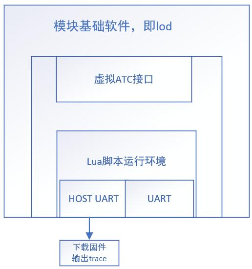

-----------------------------------------
#  什么是 Luat

在工控领域，相比于普通软件开发领域，定制业务永远比较麻烦。开发环境搭建，C语言等都是让人抓狂的事情。作为一家厚积薄发的芯片厂商，为了让人更简单的方便的利用自产芯片，适配更多的使用场景，从而扩大销路，进入业务的良性循环，[合宙](http://www.openluat.com/)决定采用这样的策略发展自身业务:

- C 语言很痛苦，那么业务逻辑能不能用个简单的语言来写？ `Lua` 自然是首选
- 当然，你也可以用合宙的库的头文件，用 C 写
- 为了让程序编译部署少坑：
   + 在核心程序（就是你即将部署到设备上的程序 `.lod`）里有一个 `Lua` 的解释器
   + 你的 `Lua` 程序会交给解释器运行
   + 这样你的程序会占用资源大一点，慢一点，但是写起来，调起来都方便。
      + 额，调起来未必吧，反正都是看 Log
- 基于这个策略，提供一些辅助工具和库
   + 开发板，提供你的业务逻辑运行平台
   + 软件工具，帮你把你的程序放到开发板里，同时看日志之类的
   + 库，帮你发觉芯片的能力。譬如GPS, WIFI 等
   + 云，给你远程控制批量控制，数据集中等能力，当然合宙的云还比较弱，毕竟是硬件厂商，做云端服务网还是有人才和技术积累等门槛跨不过，很难做到专业。苹果的云不是也烂透了嘛，企业基因问题，不是一蹴而就的事情。

> 总之，要最大限度的降低你采用合宙芯片定制自身业务逻辑的成本！

-----------------------------------------
# Luat 的基本架构

- 这里的 `lod` 基本可以想象为芯片的驱动
- 虚拟 `ATC` 接口，实际上是一个 `AT` 命令的解释器
   + 什么是 `AT` 命令，下一篇笔记再了解，应该类似一个命令结构，在库的头文件里有定义
   + 它作为一个中间层，可以让合宙有手段适配不同版本芯片对业务（Lua脚本）的一致性
   + 这样开发者起码在开发中可以忽略很多芯片的细节，减轻心智负担
- 我猜 `core` 会给其内置的 `Lua解释器` 一个上下文，里面有个 `sys|gps` 之类的的全局对象
   + 脚本调里面的方法实际上就是发 `AT` 命令
   + `AT` 命令解释器最终会通过 `core` 访问芯片的能力
- 这里的 `HOST UART` 以及 `UART` 不明白是啥意思
- 传统的工控板，是一个核心芯片（譬如合宙这款），业务逻辑是烧录在一块单片机芯片上的
   + 现在业务逻辑可以直接写在芯片里，所以你做出的版可以省掉几块钱的单片机费用
   + 可编程的单片机 `DSP` 又比较贵，设置开发环境也过于专业
   + 用这个合宙的开发栈（合宙全家桶），理论上，你一个记事本，照样开发业务
   + 而且编写调试也更方便，

> 这就是合宙想打造的一种能力，极大的拉低工控芯片的业务开发定制门槛，实际上这必然是诸多硬件芯片厂商的一个发展方向。

-----------------------------------------
# 如何上手开发

基本上要做下面几件事：

1. 购买开发板: [合宙淘宝店](https://luat.taobao.com/index.htm)
2. 注册开发板: [合宙ERP系统](http://erp.openluat.com/login)
   > 买了开发板，在合宙微信公号上有教程，微信公号在[合宙官网](http://www.openluat.com/)底部能找到
3. 下载[开发工具包](http://wiki.openluat.com/doc/tools/)
4. 克隆[Git库](https://github.com/openLuat/Luat_2G_RDA_8955)到本地
   - 这个库里面有你开发需要的需要的所有核心库(`.lod`)和脚本(`.lua`)
   - `Luat_2G_RDA_8955 ` 是个 2G 版的，是合宙最经典的方案，采用[RDA](http://www.rdamicro.com/)的技术
   - 文档上说，对应其芯片型号 `Air202、Air800、Air201等`
   - [合宙的其他项目](https://github.com/openLuat)包括
      + [Luat_4G_ASR_1802](https://github.com/openLuat/Luat_4G_ASR_1802)，看起来是采用[ASR](http://www.asrmicro.com/asrweb/)的技术，主打4G，项目应该还在进行中，不成熟(Mark @ `2018-12-10`)
      + [Luat_WiFi_WM_W600](https://github.com/openLuat)，应该是采用[WM](https://www.wm.edu/offices/it/services/network/wireless/index.php)的技术，主打WIFI场景，会进一步降低设备的运营费用（wifi不花钱嘛），看官网有最后更新日期为`28 Sep`(Mark @ `2018-12-10`)，不知道是不是高挂项目。说不定是因为最终合宙发现 WIFI 是个伪需求，坑太多。毕竟现场 WIFI 环境千差万别，远不如 2G/4G 来的爽快

> 我猜合宙是 2G 搞完了，想弄个高速版，本来应该是 3G，但是期间 4G 已经普及了，所以跳过了 3G 直接搞 4G。估计还得个一年半年才能彻底成熟。 而且主要是小芯片，2G 低功耗，而且够用，所以发展 4G 的意愿还不太强，只是认为是一个必然的方向，慢慢搞着呗。

-----------------------------------------
# 下一步: LuaTools

> 工欲善其事，必先利其器，下一步我将用 `LuaTools` 写一个 [Luat 的 Hello World](s01_luat-tools.md)

-----------------------------------------
# 相关链接

- [Luat·概述](http://wiki.openluat.com/)
- [合宙官网](http://www.openluat.com/)
- [LuaTools](http://wiki.openluat.com/doc/tools/)

-----------------------------------------
# 相关术语

- [TTS](https://en.wikipedia.org/wiki/Speech_synthesis) : Text To Speech, 语音合成
- [MQTT](https://zh.wikipedia.org/wiki/MQTT) : 消息队列遥测传输
- [OTA](https://en.wikipedia.org/wiki/Over-the-air_programming) : Over-the-air programming

-----------------------------------------

-- 未完待续 --

> - [Nutz](https://nutzam.com) : 热爱Java小伙伴们的另一个选择
> - [Nutz 社区](https://nutz.cn) : 关于Nutz，有问必答