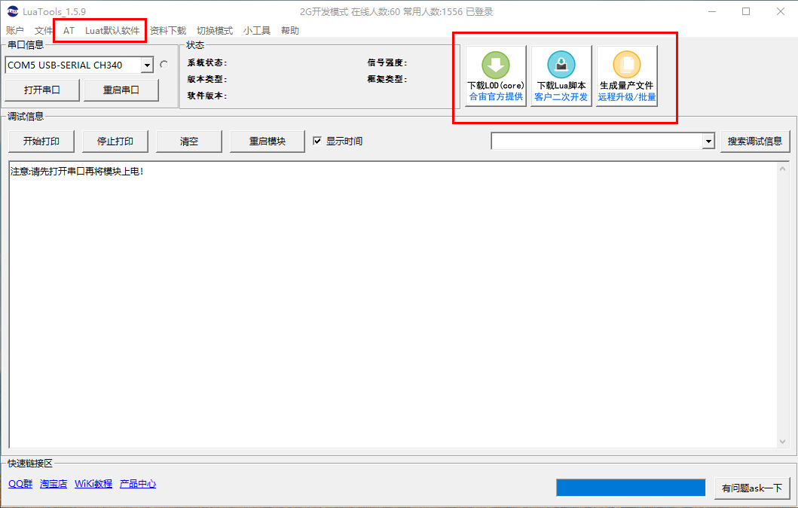
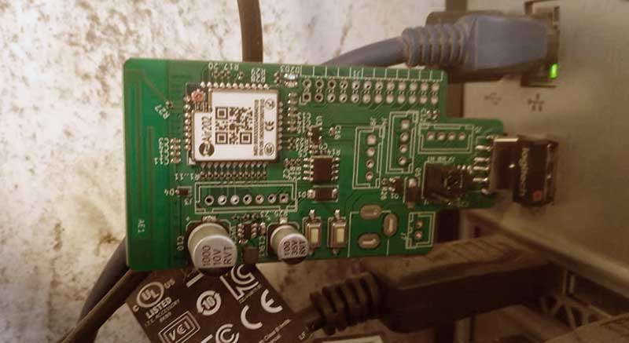
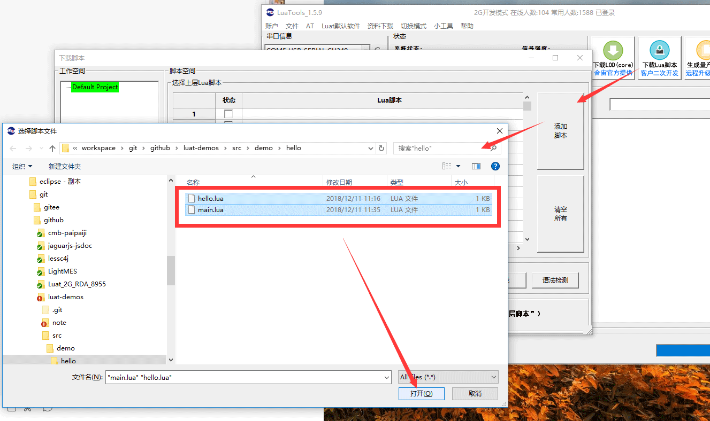
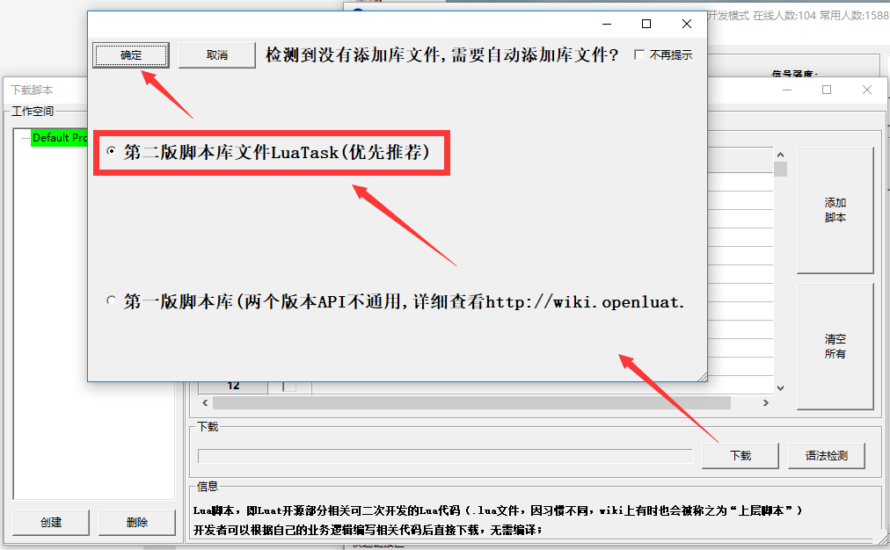
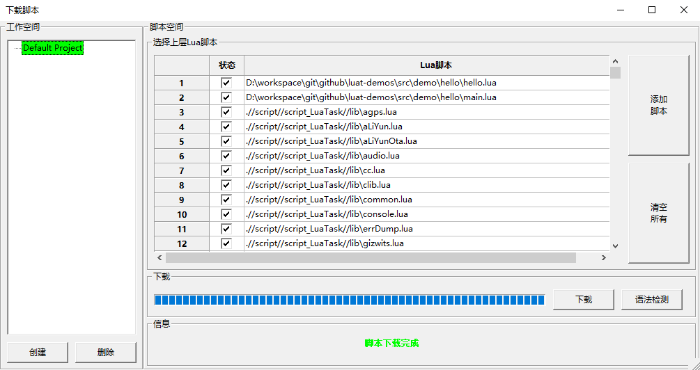
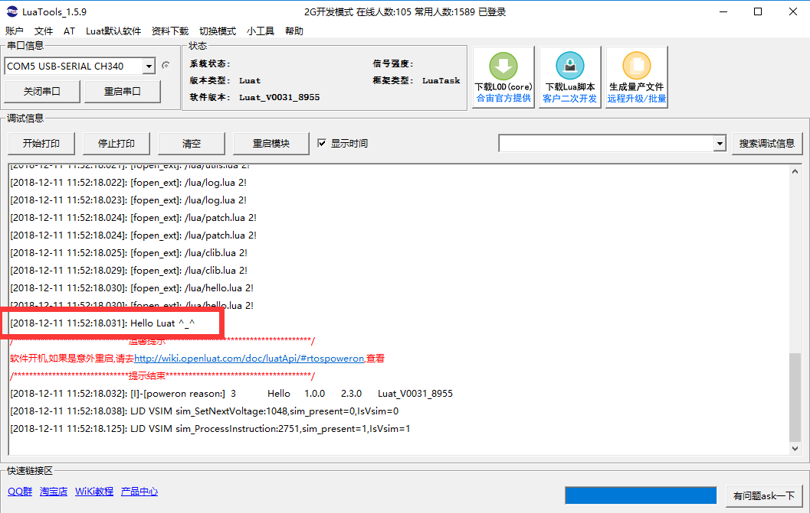

-----------------------------------------
# LuaTools 的基本介绍

首先你需要[下载LuaTools](http://wiki.openluat.com/doc/tools/)，这个页面第一张图下面有个不明显的链接 `LuaTools` 就点这个下载。

下载的 LuaTools 就是一个压缩包，应该是 `.7z` 格式的，解开它，就能能看到可执行文件 `LuaTools.exe`，双击就能打开，它的界面是这样的:



上图我画了红框的部分，应该是你今后用的最频繁的部分。我一开始看这个工具，感觉很诡异，第一个念头就是 *下载LOD* 是什么鬼？下载到哪里？ 后来转念一想才明白，这个工具的视角是来自`开发板`的。即，所谓的下载 `LOD`，就是`开发板`要从你计算机下载 `lod` 文件。 `下载Lua脚本`也是同理。

那么实际上这个工具主要提供的功能就两个：

1. 把你的程序`.lod`或者`.lua` 发布到开发板上
2. 显示你程序运行时的日志 -- *调试信息*

其他的功能现在暂时可以无视，在我看来，可能 `生成量产文件` 可能还有用。不过我现在是菜鸟，刚入门，所以自然不关心。我们继续: 

下面你需要把你的开发板连入计算机，我的环境是

- 操作系统： win10
- 开发板: Air202

随便找个 USB 口插上，就像这样：



然后在 `LuaTools` 的左上角 `串口信息` 应该就能看到你的设备模块。剩下的，按照看[官方LuaTools教程](http://ask.openluat.com/article/4)，你应该能很顺畅的烧录几次模板。所谓`烧录`就是`下载`咯。


-----------------------------------------
# 来个 Hello World

下面我们玩点稍微有意思的东西，我们准备用 `Lua` 写一个最简单的小程序： 打印一行 `Hello Luat` 的日志。

建立一个目录 

```bash
src/demo/hello/           # 程序的目录，实际上随便什么目录
    |-- hello.lua         # 主要逻辑脚本
    |-- main.lua          # 入口文件
```

这样的程序结构是根据官网抄的。基本上 `main.lua` 不存放业务逻辑，就是一个模块声明的入口。 
`hello.lua` 是主要的业务逻辑，我们这个例子当然很简单了。

> main.lua

```lua
--- main.lua
MODULE_TYPE = "Air202"
PROJECT = "Hello"
VERSION = "1.0.0"
require"sys"

require"hello"

sys.init(0,0)
sys.run()
```

> hello.lua

```lua
--- hello.lua
module(...,package.seeall)

_G.print("Hello Luat ^_^")
```

> 代码地址： https://github.com/wendal/luat-demos/tree/master/src/demo/hello

接下来，选择 `LuaTools` 里的 `下载Lua脚本`，选择上你的这两程序文件



> `工作空间`什么的不要理他，就是一个本地记录，省得你以后总选。我们现在就用 `Default Project`这个工作空间就好

看到两个文件加上后，点击 `下载`， `LuaTools` 会自动检测库文件：



选择 `第二版脚本库文件LuaTask(优先推荐)`，点击确定

> 可能是合宙第一版脚本库文件维护的程序员走了，又来了一个，看第一个不爽，就自己又写了一套 ^_^!
> 按照这个路数，估计不久之后就会有 `第三版脚本库文件了` :P



你可以看到进度条，当看到上图 `脚本下载完成` 这几个丑丑的绿字后，就表示我们的这个 `Hello` 程序已经成功的部署到开发板上了。当然，这个就是所谓的 `下载`，或者是说 `烧录`。

叉掉这个对话框，在主界面等几秒，你将看到如下日志：



看，我们的 `Hello Luat` 成功了。如果20秒后你日志依然啥都出不来，你可以按照下面步骤重试:

1. 猛击 `开始打印` 按钮，然后点一下 `重启模块`
2. 没用？ 那么
    - 把开发板拔掉
    - 把 `LuaTools` 关掉，然后再打开
    - 确保 `串口信息 > 打开串口`
    - 把开发板插上
    - 如果不出日志，点 `重启模块`
3. 还不行？ 嗯，今天天气真好，看，还有云呢 ^_^!


总之为了方便你看，我把日志 copy 出来：

```
注意:请先打开串口再将模块上电！
[2018-12-11 11:52:17.988]: CDFU_LoadSection: %d-%d

[2018-12-11 11:52:17.989]: CDFU_LoadSection: %d-%d

[2018-12-11 11:52:17.990]: ====================================
[2018-12-11 11:52:17.991]: INTR VER :Luat_V0031_8955
[2018-12-11 11:52:17.998]: BASE VER :B5595
[2018-12-11 11:52:17.999]: SCRIPT ADDR :0x00260000
[2018-12-11 11:52:17.999]: SCRIPT SIZE :0x000b0000
[2018-12-11 11:52:17.999]: BASE   ADDR :0x00210000
[2018-12-11 11:52:17.999]: BASE   SIZE :0x00050000
[2018-12-11 11:52:18.000]: ====================================
[2018-12-11 11:52:18.000]: [cust_task_main]: Enter message loop
[2018-12-11 11:52:18.000]: INTEGRITY file not exist!
[2018-12-11 11:52:18.001]: FH:file=/lua/utils.lua,len=3071,offset=9253
[2018-12-11 11:52:18.003]: FH:file=/lua/sys.lua,len=5968,offset=3258
[2018-12-11 11:52:18.004]: FH:file=/lua/patch.lua,len=1240,offset=1993
[2018-12-11 11:52:18.005]: FH:file=/lua/main.lua,len=118,offset=1848
[2018-12-11 11:52:18.006]: FH:file=/lua/log.lua,len=1174,offset=648
[2018-12-11 11:52:18.007]: FH:file=/lua/hello.lua,len=55,offset=568
[2018-12-11 11:52:18.008]: FH:file=/lua/clib.lua,len=491,offset=50
[2018-12-11 11:52:18.009]: parse_luadb_data:delupdpack=0,err=0,section=1,wrFile=0
[2018-12-11 11:52:18.011]: INTEGRITY file write begin!
[2018-12-11 11:52:18.011]: lualibc_fopen_ext /integrity.bin wb 601 1 2
[2018-12-11 11:52:18.014]: INTEGRITY file write success!
[2018-12-11 11:52:18.015]: [fopen_ext]: /lua/main.lua 2!
[2018-12-11 11:52:18.017]: RUN main.lua
[2018-12-11 11:52:18.018]: [fopen_ext]: /lua/main.lua 2!
[2018-12-11 11:52:18.018]: [fopen_ext]: /lua/sys.lua 2!
[2018-12-11 11:52:18.019]: [fopen_ext]: /lua/sys.lua 2!
[2018-12-11 11:52:18.020]: [fopen_ext]: /lua/utils.lua 2!
[2018-12-11 11:52:18.021]: [fopen_ext]: /lua/utils.lua 2!
[2018-12-11 11:52:18.022]: [fopen_ext]: /lua/log.lua 2!
[2018-12-11 11:52:18.023]: [fopen_ext]: /lua/log.lua 2!
[2018-12-11 11:52:18.024]: [fopen_ext]: /lua/patch.lua 2!
[2018-12-11 11:52:18.024]: [fopen_ext]: /lua/patch.lua 2!
[2018-12-11 11:52:18.025]: [fopen_ext]: /lua/clib.lua 2!
[2018-12-11 11:52:18.029]: [fopen_ext]: /lua/clib.lua 2!
[2018-12-11 11:52:18.030]: [fopen_ext]: /lua/hello.lua 2!
[2018-12-11 11:52:18.030]: [fopen_ext]: /lua/hello.lua 2!
[2018-12-11 11:52:18.031]: Hello Luat ^_^
[2018-12-11 11:52:18.032]: [I]-[poweron reason:]	3	Hello	1.0.0	2.3.0	Luat_V0031_8955
[2018-12-11 11:52:18.038]: LJD VSIM sim_SetNextVoltage:1048,sim_present=0,IsVsim=0
[2018-12-11 11:52:18.125]: LJD VSIM sim_ProcessInstruction:2751,sim_present=1,IsVsim=1
[2018-12-11 11:53:08.146]: LJD VSIM sim_ProcessInstruction:2751,sim_present=1,IsVsim=1
```

-----------------------------------------
# 下一步: 进一步了解 Lua 语言

> [了解 Lua 语言](s02_lua.md)

-----------------------------------------

-- 未完待续 --

[](http://nutzam.com)

> - [Nutz](https://nutzam.com) : 热爱Java小伙伴们的另一个选择
> - [Nutz 社区](https://nutz.cn) : 关于Nutz，有问必答


